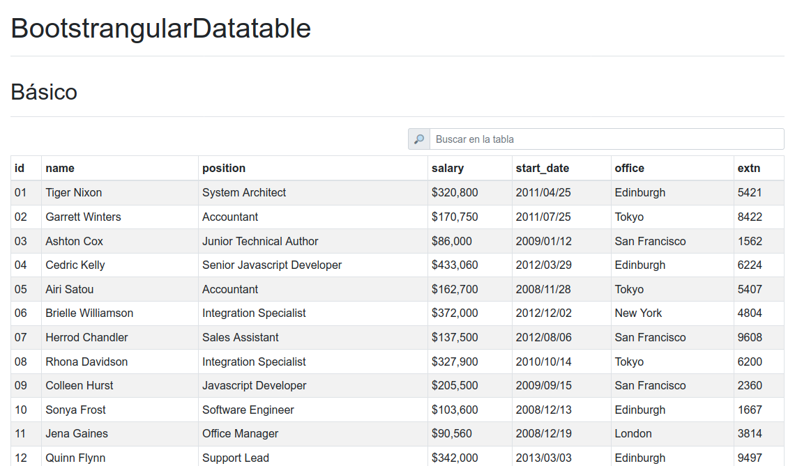
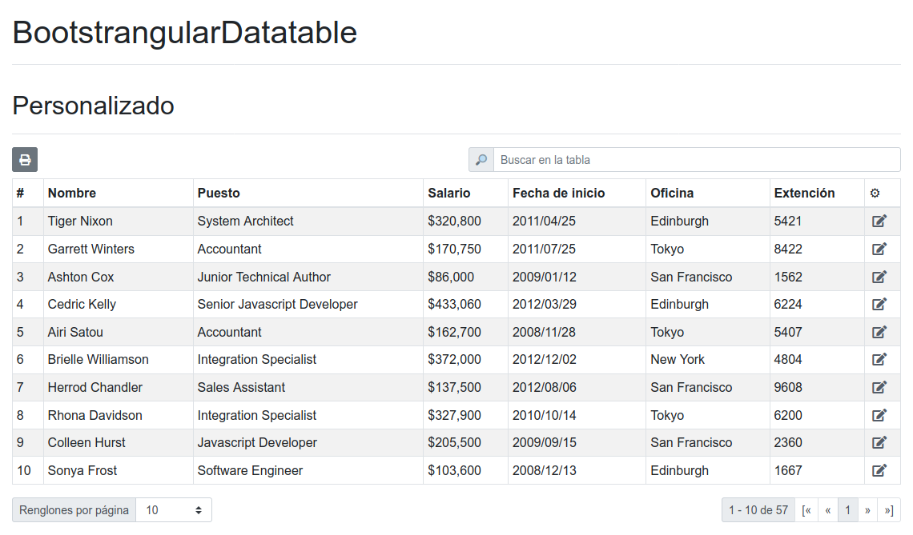

# BootstrangularDatatable

Este proyecto fue generado con [Angular CLI](https://github.com/angular/angular-cli) versión 9.1.11 por [Andrés Martínez González](https://github.com/andres-geotec).

## Descripción

Este es un simple modulo de tabla interactiva al estilo de Angular, Bootstrap y Datatable. Necesita [angular/core](https://www.npmjs.com/package/@angular/core), [bootstrap](https://www.npmjs.com/package/bootstrap) y sus dependencias ([jquery](https://www.npmjs.com/package/jquery) y [popper](https://www.npmjs.com/package/popper.js)) para funcionar.

## Ejemplos

Para los siguientes ejemplos se usaron datos definidos en en proyecto, puedes encontrarlos en la carpeta [assets/data](./src/assets/data).

### Básico

```javascript
import salary from './../assets/data/salary';
...
export class AppComponent {
  public dataSource: any[] = salary.data;
  ...
}
```

```html
<datatable [dataSource]="dataSource" [pageSize]="15"></datatable>
```



### Personalizado

```javascript
import salary from './../assets/data/salary';
import { BtnOption } from 'bootstrangular-datatable';
...
export class AppComponent {
  public dataSource: any[] = salary.data;
  public headers: any = {
    "name": "Nombre",
    "position": "Puesto",
    "salary": "Salario",
    "start_date": "Fecha de inicio",
    "office": "Oficina",
    "extn": "Extención"
  };
  public tableBtnOptions: BtnOption[] = [{
    title: 'Imprimir',
    icon: {
      origin: 'bootstrap',
      icon: 'fas fa-print'
    },
    action: () => {
      alert(`Se van a imprimir ${this.dataSource.length} registros`);
    }
  }];
  public rowBtnOptions: BtnOption[] = [{
    title: 'Editar',
    action: (row: any) => {
      console.log(row, 'se va a editar');
    },
    icon: {
      origin: 'bootstrap',
      icon: 'fas fa-edit'
    }
  }];
}
```

```html
<datatable [dataSource]="dataSource"
  [headers]="headers"
  [showNumeration]="true"
  [pageSizeOptions]="[10, 25, 50, 100]"
  [tableBtnOptions]="tableBtnOptions"
  [rowBtnOptions]="rowBtnOptions">
</datatable>
```



# Uso

## Instalación

```bash
npm i bootstrangular-datatable
```

### Cargar modulo:

```javascript
import { DatatableModule } from 'bootstrangular-datatable';
@NgModule({
  ...
  imports: [
    ...
    DatatableModule
  ]
})
```

### Usar HTML template:

```html
<datatable [dataSource]="dataSource"></datatable>
```

```javascript
[dataSource]          // Fuente de datos: -> type: object[].

[headers]             // Encabezados: -> type: object.

[pageSize]            // Tamaño de página: -> type: number.
[pageSizeOptions]     // Opciones de tamaño de página: -> type: number[]; default: [].
[pageIndex]           // Indice de página: -> type: number; default: 1.

[tableBtnOptions]     // Botones de la tabla: -> type: BtnOption[].
[rowBtnOptions]       // Botones de renglon: -> type: BtnOption[].

[showNumeration]      // Mostrar numeración: -> type: boolean; default: true.
[showSearcher]        // Mostrar buscador: -> type: boolean; default: true.
[showSizeOptions]     // Mostrar opciones de tamaño de página: -> type: boolean; default: true.
[showPaginator]       // Mostrar paginador: -> type: boolean; default: true.
```